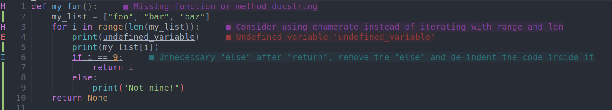
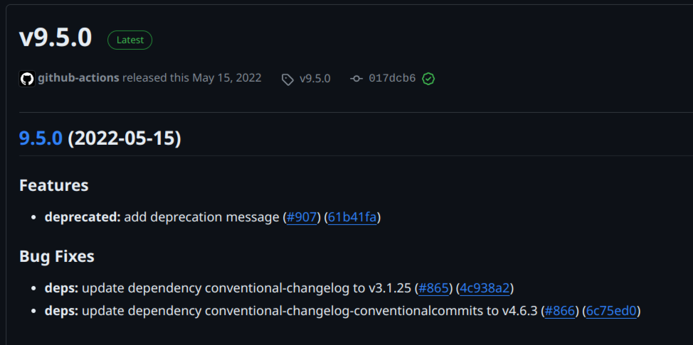

# Your missing Semester of CS
## Professionals have standards, and so should you
You ever have a codebase where people disagree on tabs/spaces? Or how many spaces to use? Or how long a line should be? Or if functions should have a space after them? Comment style? Brace style? It's pretty annoying that everyone has different ideas of what "right" looks like, and on a team the entire codebase could get messy.

Enter Black. It's opinionated so there's no debate on how code should look. Lines MUST be 80 characters at most. Spaces MUST be used and in increments of 4. It's commonly used in the industry to provide a clean and consistent codebase.
"So you're saying I'm going to memorize Black's standards and follow them?" Nope! There's an extension for that in VSCode that executes Black formatting on write. You could write some grossly formatted code, save, and it'll instantly make it clean for you. This way, you're spending less time worrying about formatting and more time coding.

## Addressing "Skill Issues" before you run the code
Pylint is another VSCode extension that can save time and catch dumb errors as you write them. It can also tell you when you're doing something inefficient and how to fix it to be more concise. 

## Docstrings
You may have noticed in the Pylint showcase that the linter got mad that I didn't write a docstring. This is a very good thing to get mad about since documentation is incredibly important when working as a team. 
By writing a docstring, VSCode's intellisense can preview that for you so you know how to use a function someone else wrote instead of having to read the code yourself. There's also a VSCode extension to assist in this.

## Conventional Commits
First, [understand how to write a good commit](https://www.freecodecamp.org/news/writing-good-commit-messages-a-practical-guide/). For example, instead of "Added docstring to my_fun", you would word it as "Add docstring to my_fun". The idea is that if you were to say "This commit will ____" followed by your commit message, the sentence would make grammatical sense. This may seem petty but it's the industry standard, as you can see in virtually any major repo on GitHub.
Now, [conventional commits](https://www.conventionalcommits.org/en/v1.0.0/) are a bit special. Instead of "Add docstring to my_fun", it would be "docs(my_fun): Add docstring". This is good practice so you can tell what part of the code a commit changes at a glance. There's also tools to generate changelogs based on your conventional commits, which can give a client a quick report on what's been worked on over the course of the sprint. 

## Git
Many people in this degree never learn Git properly, because the university fails to teach it. If you get a programming job after graduating, you will be expected to know and use it. Luckily, it's pretty easy to learn, I mostly use:

`git add <filename>` to add the file to my commit. This is useful if I change 10 different files and don't want them all lumped into one giant commit.

`git commit -m "fix(toolbar): Make toolbar stay at the top of the screen"` to create a commit based on what I added

`git push` to send my commits to the repo

### Branch switching and merging
Typically, a git branch should be per-feature. So I could have a branch called `fix-toolbar` and you could have your own branch called `add-search`. This way, we can work independently and not worry about our code conflicting. To create my branch:

`git branch fix-toolbar` this will create my branch (kinda like mkdir, if you will)

`git checkout fix-toolbar` this will switch to my branch (kinda like cd, if you will)

Then when I'm all done with my branch, I can do:

`git checkout develop` to move back to develop

`git merge fix-toolbar` to merge my changes in

All of these commands so far have been assuming you're using a terminal, but if you want to make your life easier, the [GitLens VSCode extension](https://marketplace.visualstudio.com/items?itemName=eamodio.gitlens) exists as well as a [guide on using Git](https://code.visualstudio.com/docs/sourcecontrol/overview) from Microsoft.
